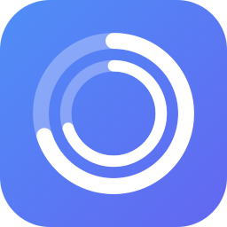

<p align="center">
  
</p>

<h1 align="center">Clusage</h1>

<p align="center">
  <strong>Claude usage tracking for your menu bar</strong><br>
  Monitor your 5-hour and 7-day rate limit windows, see momentum and projections, and never get surprised by a rate limit again.
</p>

<p align="center">
  <a href="https://github.com/seventwo-studio/clusage/releases/latest"></a>
  
  
</p>

## Install

**[Download the latest release](https://github.com/seventwo-studio/clusage/releases/latest)**

1. Download `Clusage.dmg` from the latest release
2. Open the DMG and drag **Clusage** to your Applications folder
3. Launch Clusage — it lives in your menu bar
4. Follow the onboarding to import your Claude Code credentials from the keychain

> Clusage requires macOS 26 (Tahoe) or later.

## Features

- **Real-time usage tracking** — 5-hour and 7-day rate limit windows with auto-polling
- **Menu bar icon** — always-visible usage at a glance
- **Momentum engine** — velocity, acceleration, ETA to ceiling, burst detection
- **7-day projections** — projected usage at reset, daily budget, pacing status
- **Granular 7-day tracking** — sub-integer interpolation between API ticks
- **Smart polling** — adapts frequency based on activity, detects Claude processes, respects rate limits
- **Dashboard** — detailed gauges, charts, and account info in a transparent window
- **Widget** — macOS widget for quick usage checks
- **Multi-account** — track multiple Claude accounts simultaneously
- **ClaudeLine integration** — exposes `~/.claude/clusage-api.json` for [ClaudeLine](https://github.com/nicekid1/claudeline) status line components

## ClaudeLine Integration

Clusage writes usage data to `~/.claude/clusage-api.json`, which [ClaudeLine](https://github.com/nicekid1/claudeline) reads automatically. This means ClaudeLine doesn't need to hit the Anthropic API directly — Clusage is the single source of truth.

Available ClaudeLine components:

| Component | Description | Example |
|-----------|-------------|---------|
| `usage:5h` | 5-hour utilization | `42%` |
| `usage:7d` | 7-day utilization | `58%` |
| `usage:5h-reset` | Time until 5h reset | `3h 32m` |
| `usage:7d-reset` | Time until 7d reset | `2d 5h` |
| `usage:5h-bar` | 5h progress bar | `H▰▰▱▱▱▱` |
| `usage:7d-bar` | 7d progress bar | `W▰▰▰▱▱` |
| `usage:velocity` | Usage velocity | `2.3 pp/hr` |
| `usage:intensity` | Intensity level | `moderate` |
| `usage:eta` | ETA to ceiling | `1h 23m` |
| `usage:7d-granular` | Interpolated 7-day | `46.3%` |
| `usage:7d-projected` | Projected at reset | `62%` |
| `usage:budget` | Daily budget | `14.3 pp/day` |
| `usage:budget-status` | Pacing status | `on_track` |
| `account:email` | Account email | `you@example.com` |

## Building from Source

Requires [Tuist](https://tuist.io) and Xcode with Swift 6.2 support.

```bash
git clone https://github.com/seventwo-studio/clusage.git
cd clusage
tuist generate --no-open
xcodebuild -scheme Clusage -configuration Release build
```

## License

MIT
